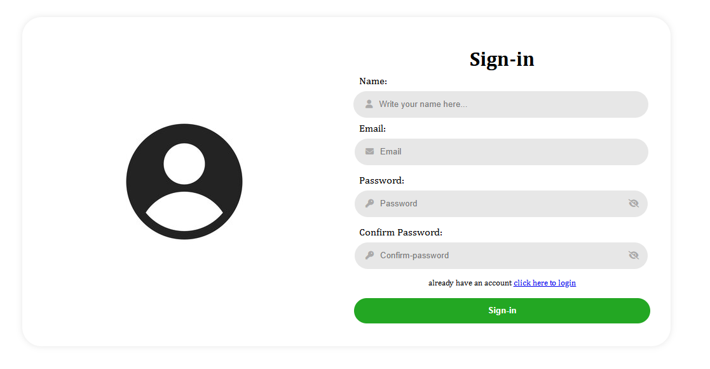

# Modern Form Validator

A modern, responsive form with real-time validation and interactive UI elements built with HTML, CSS, and jQuery.



## Features

- 🎯 Real-time form validation
- 👁️ Password visibility toggle
- ✈️ Interactive submit button with paper plane animation
- 📱 Fully responsive design
- 🎨 Modern UI with smooth transitions
- ⚡ Instant validation feedback

## Validation Features

- Email format validation
- Password strength requirements
- Password matching verification
- Real-time feedback messages

## Technologies Used

- HTML5
- CSS3
- jQuery
- Font Awesome Icons

## Installation

1. Clone the repository:
```bash
git clone https://github.com/DammyCodes-all/Modern-form.git
```

2. Open `https://modern-form-two.vercel.app` in your browser

## Usage

1. Fill in the required fields:
   - Email
   - Password
   - Confirm Password

2. The form provides real-time validation:
   - Green borders for valid inputs
   - Red borders for invalid inputs
   - Helpful error messages

3. Use the eye icon to toggle password visibility

## Contributing

1. Fork the project
2. Create your feature branch (`git checkout -b feature/AmazingFeature`)
3. Commit your changes (`git commit -m 'Add some AmazingFeature'`)
4. Push to the branch (`git push origin feature/AmazingFeature`)
5. Open a Pull Request

## Contact

Your Name - [@YourTwitter](https://twitter.com/YourTwitter)

Project Link: [https://github.com/DammyCodes-all/Modern-form](https://modern-form-two.vercel.app/)